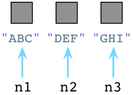
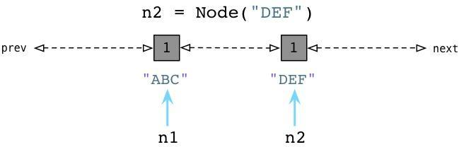

# Python 垃圾回收机制

## Garbage collection(GC)

现在的高级语言如java,c#等,都采用了垃圾收集机制,而不再是c,c++里用户自己管理维护内存的方式.
自己管理内存极其自由,可以任意申请内存,但如同一把双刃剑,为大量内存泄露,悬空指针等bug埋下隐患.
对于一个字符串、列表、类甚至数值都是对象,且定位简单易用的语言,自然不会让用户去处理如何分配回收内存的问题.
python里也同java一样采用了垃圾收集机制,不过不一样的是:
python采用的是引用计数机制为主,标记-清除和分代收集两种机制为辅的策略.

### 引用计数机制:

python里每一个东西都是对象,它们的核心就是一个结构体:PyObject.

```c
typedef struct_object {
 int ob_refcnt;
 struct_typeobject *ob_type;
} PyObject;
```

PyObject是每个对象必有的内容,其中ob_refcnt就是做为引用计数.
当一个对象有新的引用时,它的ob_refcnt就会增加,当引用它的对象被删除,它的ob_refcnt就会减少:

```c
#define Py_INCREF(op)   ((op)->ob_refcnt++) //增加计数
#define Py_DECREF(op) \ //减少计数
    if (--(op)->ob_refcnt != 0) \
        ; \
    else \
        __Py_Dealloc((PyObject *)(op))
```

当引用计数为0时,该对象生命就结束了.

引用计数机制的优点:

1. 简单
2. 实时性:一旦没有引用,内存就直接释放了.不用像其他机制等到特定时机.实时性还带来一个好处:处理回收内存的时间分摊到了平时.

引用计数机制的缺点:

1. 维护引用计数消耗资源
2. 循环引用
```c
list1 = []
list2 = []
list1.append(list2)
list2.append(list1)
```

list1与list2相互引用,如果不存在其他对象对它们的引用,list1与list2的引用计数也仍然为1,
所占用的内存永远无法被回收,这将是致命的.对于如今的强大硬件,缺点1尚可接受,
但是循环引用导致内存泄露,注定python还将引入新的回收机制.(标记清除和分代收集).

### 应用程序那颗跃动的心

GC系统所承担的工作远比"垃圾回收"多得多。实际上，它们负责三个重要任务。它们

- 为新生成的对象分配内存。
- 识别那些垃圾对象，并且
- 从垃圾对象那回收内存。

如果将应用程序比作人的身体：所有你所写的那些优雅的代码，业务逻辑，算法，应该就是大脑。
垃圾回收就是应用程序那颗跃动的心。像心脏为身体其他器官提供血液和营养物那样，垃圾回收器为你的应该程序提供内存和对象。
如果心脏停跳，过不了几秒钟人就完了。如果垃圾回收器停止工作或运行迟缓,像动脉阻塞,你的应用程序效率也会下降，直至最终死掉。

### Python 的对象分配

一个简单的类：

```python
class Node:
    def __init__(self, val):
        self.value = val

print(Node(1))
print(Node(1))
```

例如我们用Pyhon来创建一个Node对象：


当创建对象时Python立即向操作系统请求内存。(Python实际上实现了一套自己的内存分配系统，在操作系统堆之上提供了一个抽象层。)

当我们创建第二个对象的时候，再次像OS请求内存：


看起来够简单吧，在我们创建对象的时候，Python会花些时间为我们找到并分配内存。

### Python 开发者住在卫生之家庭


用完的垃圾对象会立即被Python打扫干净


让我们回到前面提到的三个Python Node对象：



在内部，创建一个对象时，Python总是在对象的C结构体里保存一个整数，称为 引用数。期初，Python将这个值设置为1：


值为1说明分别有个一个指针指向或是引用这三个对象。假如我们现在创建一个新的Node实例，JKL：


与之前一样，Python设置JKL的引用数为1。然而，请注意由于我们改变了n1指向了JKL，不再指向ABC，Python就把ABC的引用数置为0了。
此刻，Python垃圾回收器立刻挺身而出！每当对象的引用数减为0，Python立即将其释放，把内存还给操作系统：


上面Python回收了ABC Node实例使用的内存.
Python的这种垃圾回收算法被称为引用计数。是George-Collins在1960年发明.

现在来看第二例子。加入我们让n2引用n1：


上图中左边的DEF的引用数已经被Python减少了，垃圾回收器会立即回收DEF实例。同时JKL的引用数已经变为了2 ，因为n1和n2都指向它。

### Python中的循环数据结构以及引用计数

在Python中，每个对象都保存了一个称为引用计数的整数值，来追踪到底有多少引用指向了这个对象。
无论何时，如果我们程序中的一个变量或其他对象引用了目标对象，Python将会增加这个计数值，而当程序停止使用这个对象，
则Python会减少这个计数值。一旦计数值被减到零，Python将会释放这个对象以及回收相关内存空间。

从六十年代开始，计算机科学界就面临了一个严重的理论问题，那就是针对引用计数这种算法来说，如果一个数据结构引用了它自身，
即如果这个数据结构是一个循环数据结构，那么某些引用计数值是肯定无法变成零的。为了更好地理解这个问题，让我们举个例子。
下面的代码展示了一些上周我们所用到的节点类：


我们有一个构造器(在Python中叫做 init )，在一个实例变量中存储一个单独的属性。在类定义之后我们创建两个节点，ABC以及DEF，在图中为左边的矩形框。两个节点的引用计数都被初始化为1，因为各有两个引用指向各个节点(n1和n2)。

现在，让我们在节点中定义两个附加的属性，next以及prev：


Python中你可以在代码运行的时候动态定义实例变量或对象属性。

我们设置 n1.next 指向 n2，同时设置 n2.prev 指回 n1。现在，我们的两个节点使用循环引用的方式构成了一个双端链表。
同时请注意到 ABC 以及 DEF 的引用计数值已经增加到了2。这里有两个指针指向了每个节点：首先是 n1 以及 n2，其次就是 next 以及 prev。

现在，假定我们的程序不再使用这两个节点了，我们将 n1 和 n2 都设置为null(Python中是None)。


好了，Python会像往常一样将每个节点的引用计数减少到1。

### 在Python中的零代(Generation Zero)

请注意在以上刚刚说到的例子中，我们以一个不是很常见的情况结尾.
我们的程序不再使用这些节点对象了，所以我们希望Python的垃圾回收机制能够足够智能去释放这些对象并回收它们占用的内存空间。
但是这不可能，因为所有的引用计数都是1而不是0。Python的引用计数算法不能够处理互相指向自己的对象。

当然，上边举的是一个故意设计的例子，但是你的代码也许会在不经意间包含循环引用并且你并未意识到。
事实上，当你的Python程序运行的时候它将会建立一定数量的“浮动垃圾”，Python的GC不能够处理未使用的对象因为应用计数值不会到零。

这就是为什么Python要引入Generational GC算法的原因！正如Ruby使用一个链表(free list)来持续追踪未使用的、自由的对象一样，
Python使用一种不同的链表来持续追踪活跃的对象。而不将其称之为“活跃列表”，Python的内部C代码将其称为零代(Generation Zero)。
每次当你创建一个对象或其他什么值的时候，Python会将其加入零代链表：


从上边可以看到当我们创建ABC节点的时候，Python将其加入零代链表。请注意到这并不是一个真正的列表，并不能直接在你的代码中访问，事实上这个链表是一个完全内部的Python运行时。

相似的，当我们创建DEF节点的时候，Python将其加入同样的链表：



现在零代包含了两个节点对象。(他还将包含Python创建的每个其他值，与一些Python自己使用的内部值。)

### 检测循环引用

随后，Python会循环遍历零代列表上的每个对象，检查列表中每个互相引用的对象，根据规则减掉其引用计数。在这个过程中，Python会一个接一个的统计内部引用的数量以防过早地释放对象。

为了便于理解，来看一个例子：


从上面可以看到 ABC 和 DEF 节点包含的引用数为1.有三个其他的对象同时存在于零代链表中，蓝色的箭头指示了有一些对象正在被零代链表之外的其他对象所引用。(接下来我们会看到，Python中同时存在另外两个分别被称为一代和二代的链表)。
这些对象有着更高的引用计数因为它们正在被其他指针所指向着。

接下来你会看到Python的GC是如何处理零代链表的。


通过识别内部引用，Python能够减少许多零代链表对象的引用计数。在上图的第一行中你能够看见ABC和DEF的引用计数已经变为零了，这意味着收集器可以释放它们并回收内存空间了。剩下的活跃的对象则被移动到一个新的链表：一代链表。

### Python中的GC阈值

Python什么时候会进行这个标记过程？随着你的程序运行，Python解释器保持对新创建的对象，以及因为引用计数为零而被释放掉的对象的追踪。从理论上说，这两个值应该保持一致，因为程序新建的每个对象都应该最终被释放掉。

当然，事实并非如此。因为循环引用的原因，并且因为你的程序使用了一些比其他对象存在时间更长的对象，从而被分配对象的计数值与被释放对象的计数值之间的差异在逐渐增长。一旦这个差异累计超过某个阈值，则Python的收集机制就启动了，并且触发上边所说到的零代算法，释放“浮动的垃圾”，并且将剩下的对象移动到一代列表。

随着时间的推移，程序所使用的对象逐渐从零代列表移动到一代列表。而Python对于一代列表中对象的处理遵循同样的方法，一旦被分配计数值与被释放计数值累计到达一定阈值，Python会将剩下的活跃对象移动到二代列表。

通过这种方法，你的代码所长期使用的对象，那些你的代码持续访问的活跃对象，会从零代链表转移到一代再转移到二代。通过不同的阈值设置，Python可以在不同的时间间隔处理这些对象。Python处理零代最为频繁，其次是一代然后才是二代。
